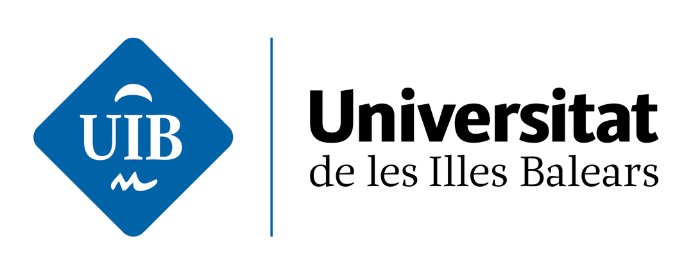

# PracticaExamenProg2
Recopilacion de ejercicios de la clase de Programacion II de la UIB.
Soluciones del examen de programcion II del año 22/23 convoctoria ordinaria.

----------------------------------------
Dylan Luigi Canning Garcia  
**Ingenieria Informatica** 
*Universitat de les Illes Balears* 

